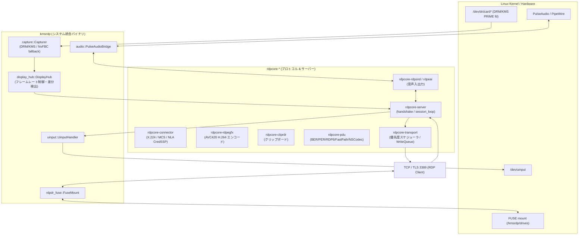
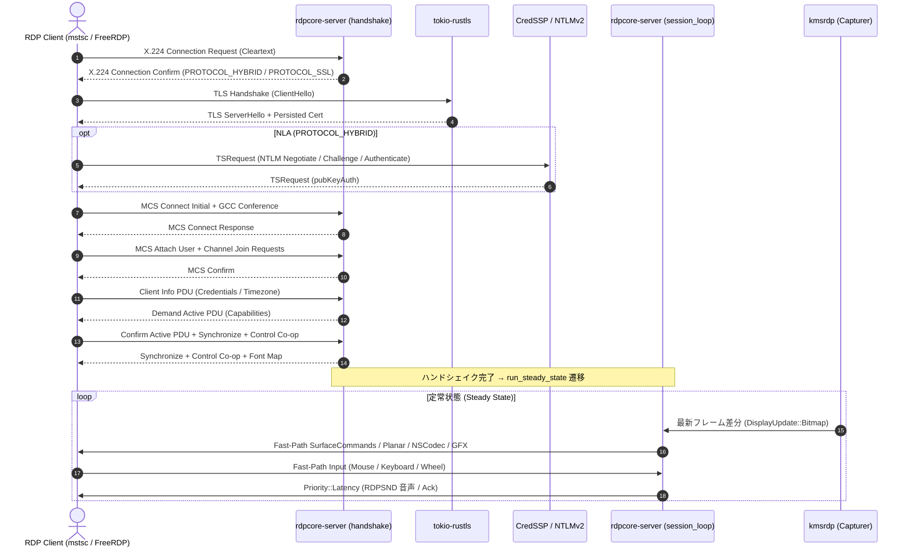

# KMSRDP アーキテクチャ解説書

本書は、KMSRDP（Linux DRM/KMS scanout capture Pure Rust RDP Server）の内部アーキテクチャ、モジュール構成、画面キャプチャ・エンコードパイプライン、および接続ライフサイクルを解説したドキュメントです。

---

## 1. 全体アーキテクチャ俯瞰

KMSRDP は、コンポジタや X11/Wayland サーバーの協力なしに、Linux カーネルの DRM/KMS からスキャンアウト（画面表示バッファ）を直接キャプチャし、Pure Rust で実装された RDP スタックを通じてクライアントに配信します。

---

## 2. コアモジュール構成と責務

### 2.1 `rdpcore-server`（RDP サーバーコア）
* **`server::handshake`**: Cleartext X.224 接続ネゴシエーション、TLS アップグレード、CredSSP / NTLMv2 認証、ClientInfo 処理、Demand Active PDU 送信。
* **`server::session_loop`**: 定常状態の非同期 `tokio::select!` ループ。Fast-Path 入力・各静的/動的仮想チャネルの PDU ディスパッチおよびリサイズ制御。
* **`server::frame_pump`**: 画面フレームおよび差分タイルのエンコード・送信スケジューリング（SurfaceCommands / Planar RLE / NSCodec / RDPEGFX AVC420）。重いエンコード処理は `spawn_blocking` にオフロード。
* **`server::input_handler`**: Fast-Path キーボード（スキャンコード・日本語キー）、マウス移動/クリック/ホイール、Unicode イベントの解析と変換。
* **`server::metrics`**: フレーム数、圧縮タイル数、送信バイト数などのパフォーマンス統計収集。

### 2.2 `kmsrdp`（Linux システム統合）
* **`capture::dmabuf`**: DRM カードデバイスのオープンと PRIME DMA-BUF の CPU キャッシュ同期（`DMA_BUF_IOCTL_SYNC`）。
* **`capture::display_mode`**: `KMSRDP_DISPLAY` に基づく単一コネクタまたはマルチモニタ合成モードの判定。
* **`capture::drm_discover`**: `/dev/dri/card*` の走査、コネクタ・CRTC・プライマリプレーンの検出、ホットプラグ更新。
* **`capture::pixel_diff`**: メモリ確保前の直前フレームとの差分判定（`take_pixels`）とビットブロック転送（`blit_bgrx`）。
* **`capture::drm_capturer`**: DRM/KMS プライマリプレーンキャプチャループ、GBM/EGL デタイル、マルチヘッド合成。
* **`gpu_detile`**: タイル配置されたフレームバッファ（Intel / AMD 等の modifier 付き）を GBM / EGL を用いて線形 BGRX に変換。
* **`nvfbc`**: CRTC が未バインドの場合や NVIDIA プロプライエタリ環境向けの NvFBC キャプチャフォールバック。

---

## 3. RDP 接続シーケンス（ライフサイクル）

---

## 4. 画面キャプチャ・差分エンコードパイプライン

1. **ゼロアロケーション差分判定 (`take_pixels`)**:
   - DRM または NvFBC から取得したバッファを、メモリ確保を行う前に直前フレームのバッファと `memcmp` / `find_dirty_rects` で比較。
   - 静止画（差分ゼロ）の場合は新しい `Arc<[u8]>` を一切ヒープ確保せず、空バッファと `unchanged = true` を返却して CPU / メモリを節約。
2. **優先度付きパケットスケジューリング (`rdpcore-transport`)**:
   - `Priority::Latency`: 音声 PCM チャンク（RDPSND）、入力応答、制御 PDU。
   - `Priority::Bulk`: 巨大な画像フレーム/差分ビットマップ、クリップボードデータ。
   - 大量の画面更新が発生しても、パケットスケジューラにより音声やキーボード/マウスの遅延・途切れを防止。
